# Machine Learning Engineer with Azure ML - Project 2

This is the second project in the course. There are 2 parts to this project: 
1. Building an AutoML experiment using the Azure Auto ML, Deploying it, consuming the endpoint. 
    The dataset is downloaded from the link provided in the project- BankMarketing dataset. https://automlsamplenotebookdata.blob.core.windows.net/automl-sample-notebook-data/bankmarketing_train.csv. This dataset is registered in ML studio. 
    A Compute cluster is created with the specification. Standard_DS12_v2 with minimum nodes as 1. 
    Auto ML experiment is created using Azure Auto ML
    The experiment type is Classifaction. This experiement took close to 1 hr 20 mins to complete. 
    Then the best model is choosen and is deployed with authentication enabled using Azure container instance. 
    The deployed model is consumed using an endpoint using Swagger interface. 
2. Building the model, publishing, consuming it using the pipeline. 
    The same dataset is used for this experiment as well. 
    But this time it is done from Jupyter notebook and couple of project parameters are modified. 
    The same steps are followed but from the notebook interface building the pipeline , deploying the model, consuming it from an endpoint. 

## Architectural Diagram
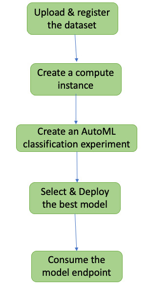
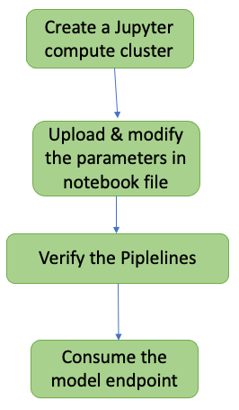

1. The dataset is downloaded from the link provided in the project- BankMarketing dataset. This dataset is registered in ML studio. 
2. A Compute cluster is created with the specification. Standard_DS12_v2 with minimum nodes as 1. 
3. Auto ML experiment is created using Azure Auto ML
4. The experiment type is Classifaction. This experiement took close to 1 hr 20 mins to complete. 
5. Then the best model is choosen and is deployed with authentication enabled using Azure container instance. 
6. The deployed model is consumed using an endpoint using Swagger interface. 

## Key Steps
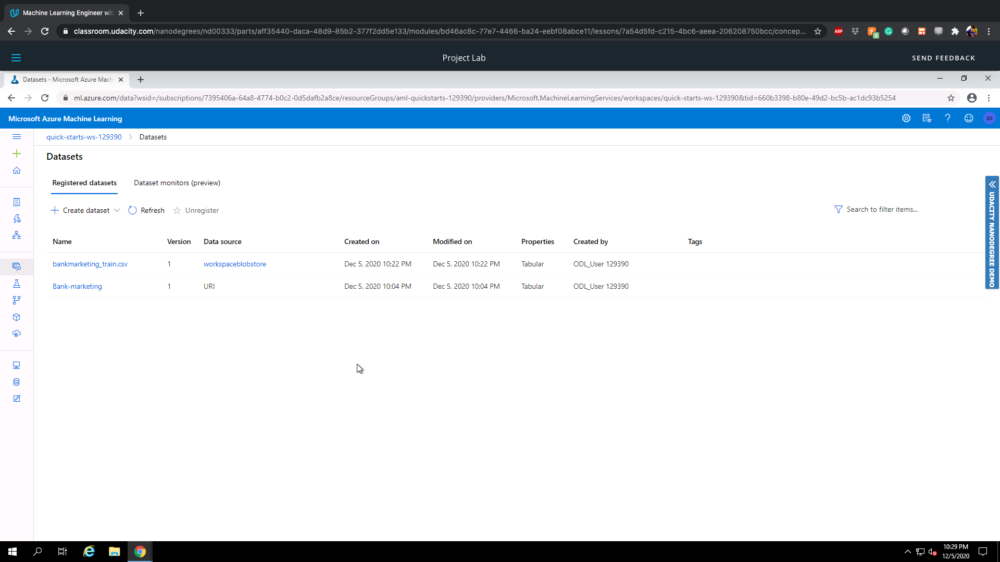
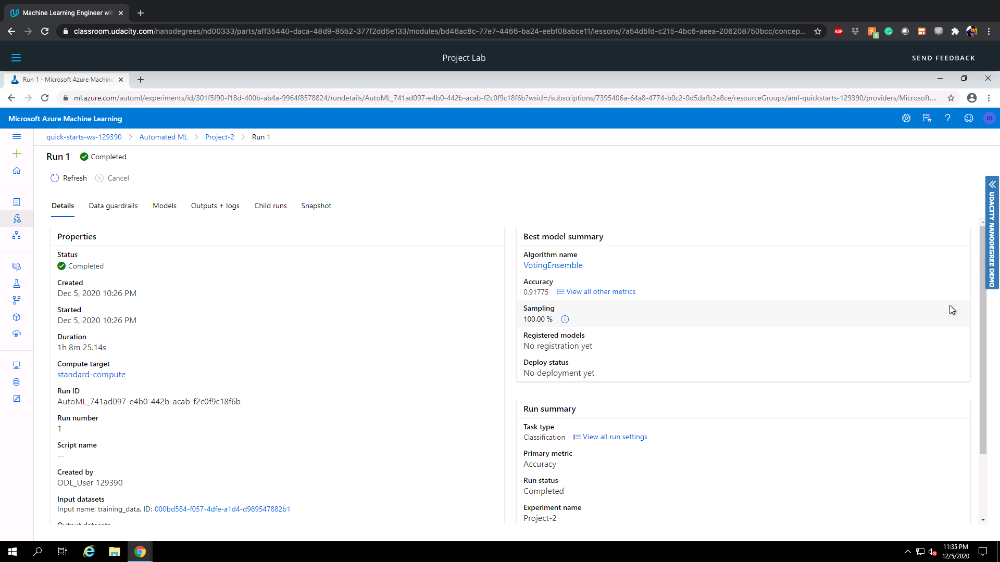
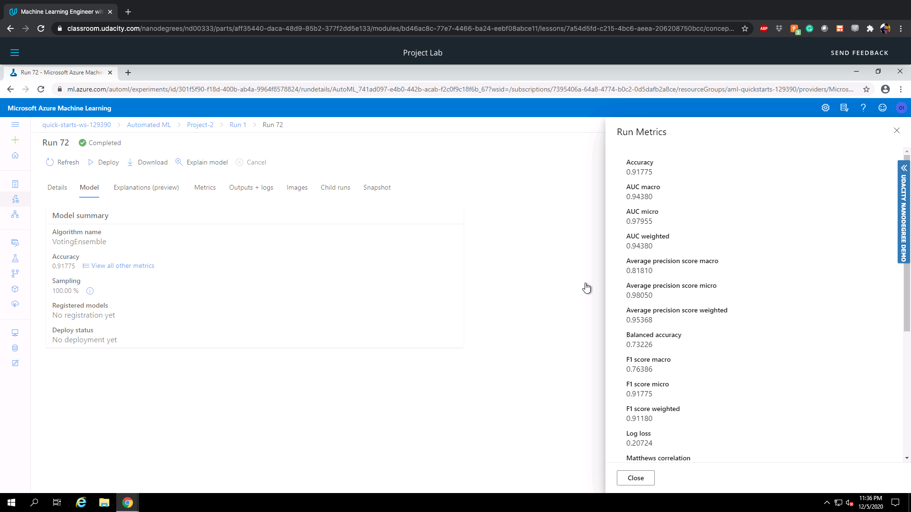
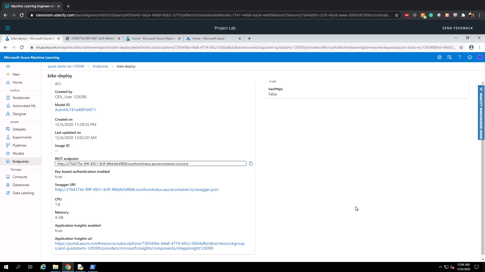
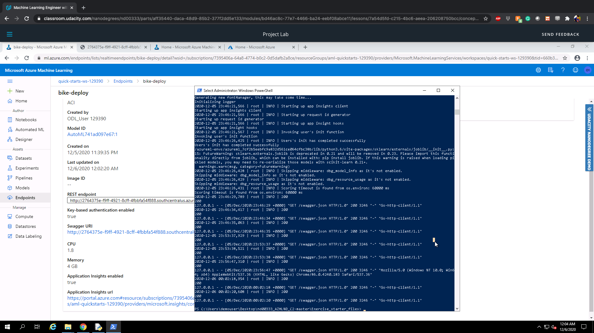
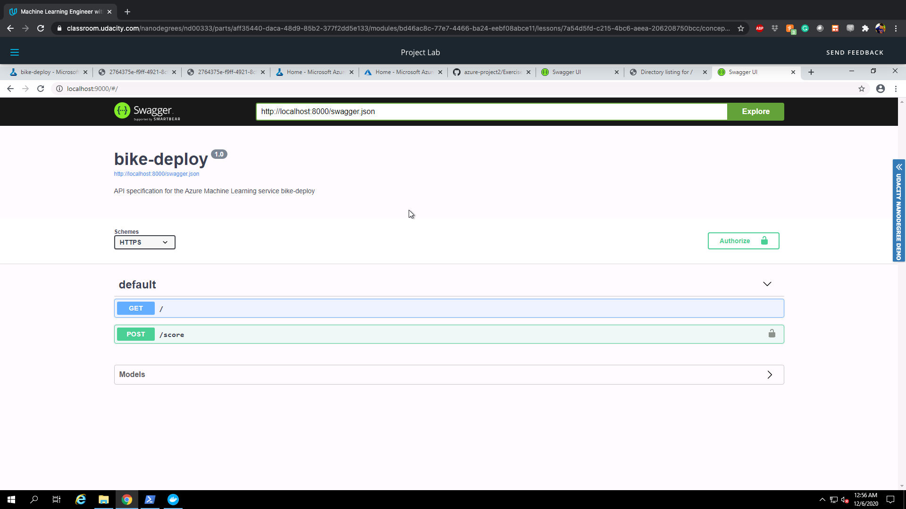
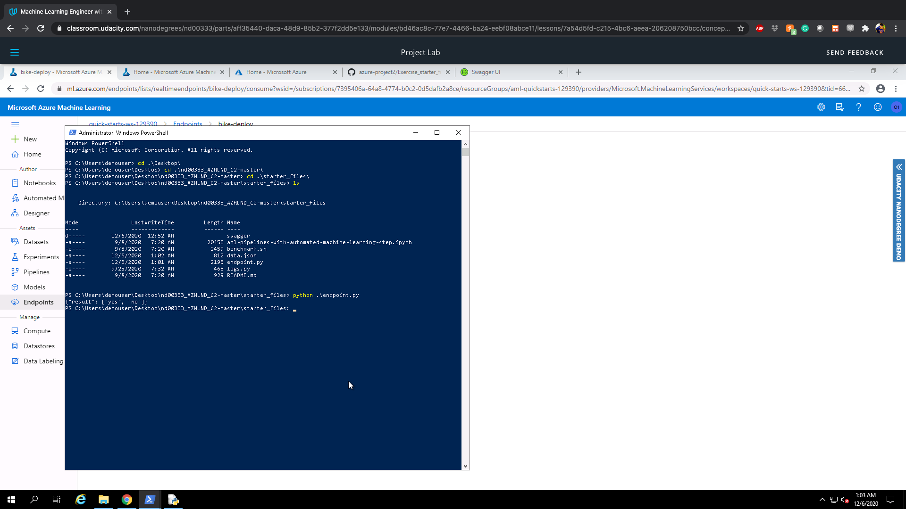
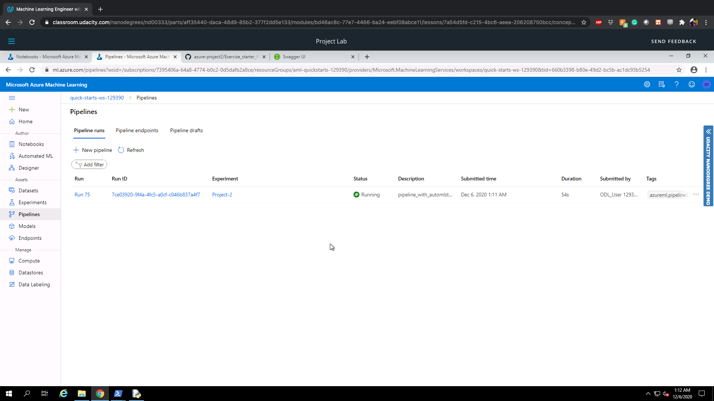
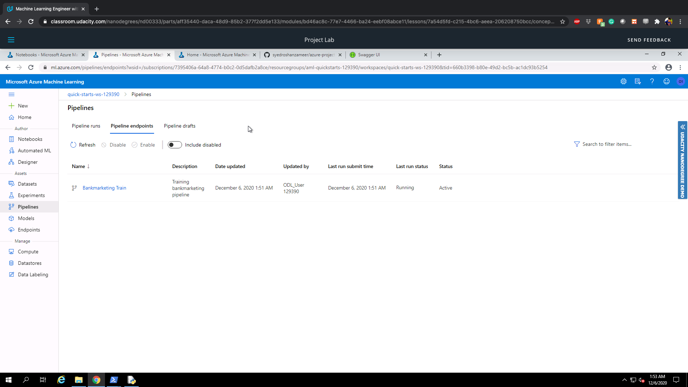
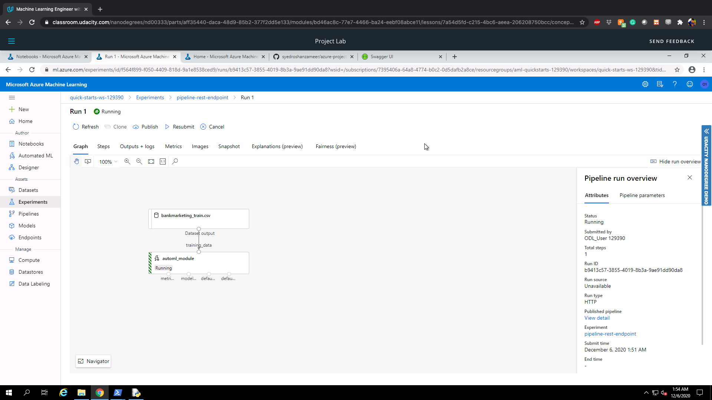
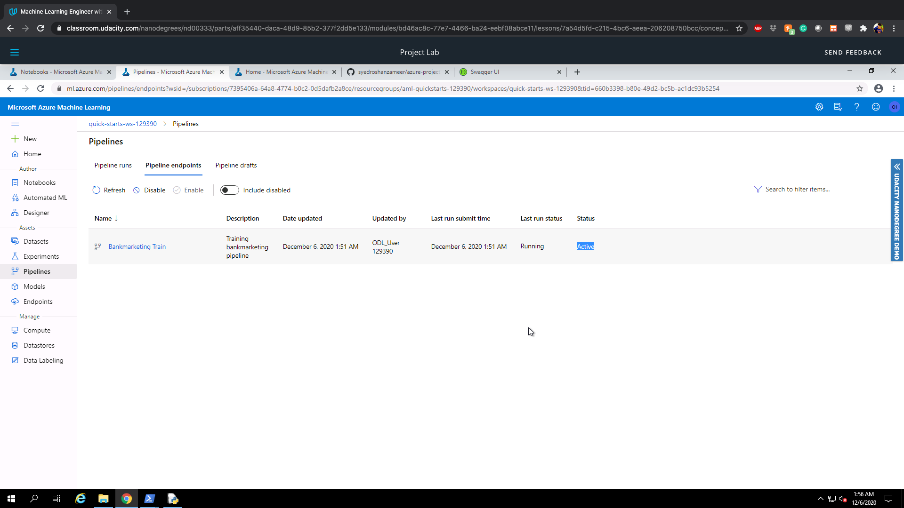
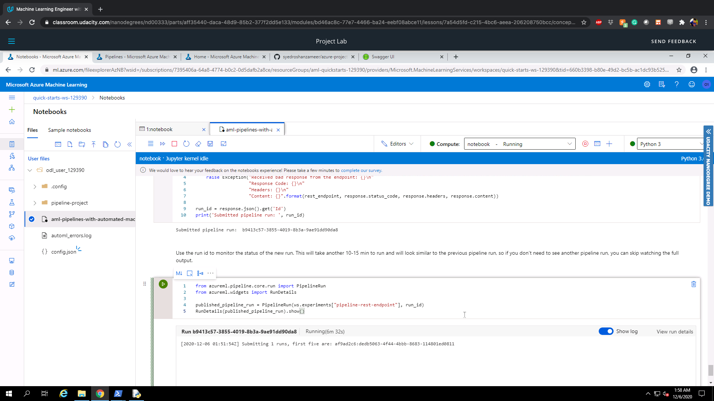
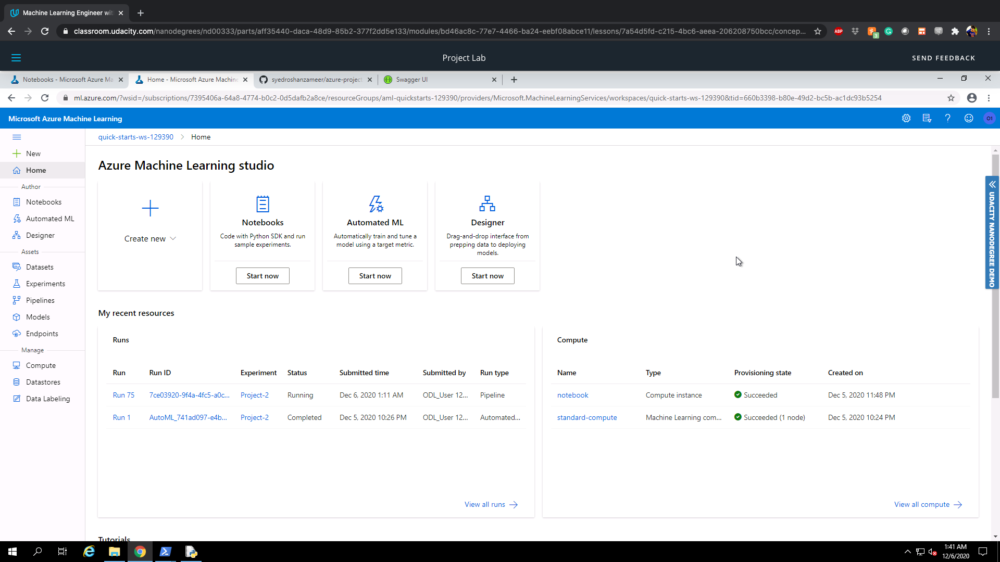

Some of the key steps involve: 
1. Registering the dataset
2. Running the experiment
3. choosing the best model and deploying it. 
4. Downloading the config file from the right hand side of the azure platform. 
5. Enabling logging using Application insights. 
6. Consuming the Swagger end point using the created docker container and opening the port in localhost. I have used port 9000 since I was facing issues with port 80 for some reason. 
7. Taking a look at the swagger json file in the HTTP API response.
8. Finally executing the endpoint.py file to check the result in the json format. 
10. uploading the jupyter notebook and changing some of its parameters and running the cells. Taking a look at the appropriate execution steps and pipelines. 

** I have added all the screenshots in the "project2-screenshots" folder and I have named them appropriately.

## Screen Recording
https://youtu.be/ZHEODdhU7fE

## Standout Suggestions
The port selection was one of the tricky part for me since port 80 was not giving an kind of error but when I try to access the localhost from the browser it just says "Its working". Later I changed the port to 9000 and I was able to access it from Chrome. 
Also the localhost doesn;t load the website in internet explorer for some reason. It works only in Chrome. 
When editing the url inside the swagger interface. I had to change it to HTTP from HTTPS(this doesnt work). 
